# ESGI - Design Pattern en C#
###### tags: `Sciences U`, `ESGI`, `Design Pattern`, `.NET`, `C#`
###### date de dernière modification: `06/07/2022`

---------
## Rendu final

La solution contenant les patrons implémentés pour la note finale se trouve à cet emplacement:  
`rendu\PEGAZ_Design_Pattern\PEGAZ_Design_Pattern.sln`

Chaque projet contient un exemple de design pattern et est représenté sous la forme d'une application console.  
Tous les détails spécifiques au design pattern exécuté sont affichés en premier dans la console.  
Exemple d'exécution:
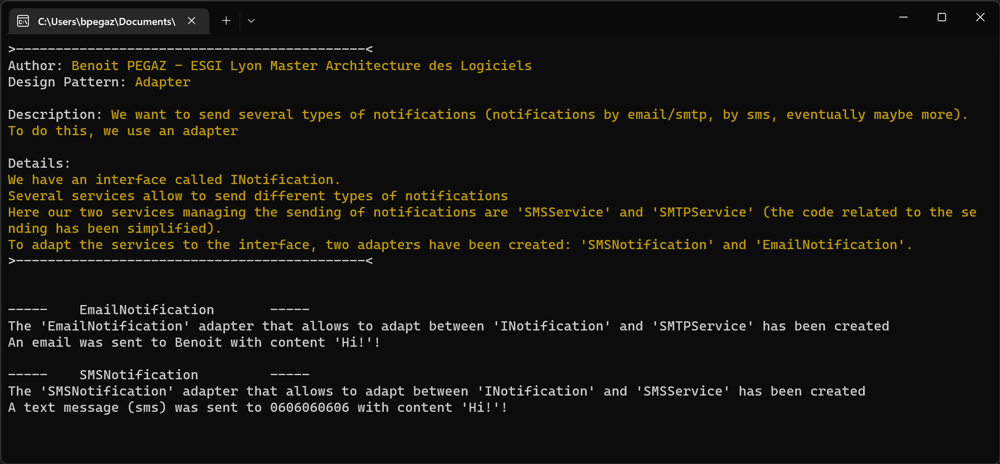  

---------

## Table des matières
- [Pattern de conception](#pattern-de-conception)  
  - [x] [Abstract factory](#abstract-factory)  
  - [ ] [Pattern Builder](#pattern-builder)  
  - [ ] [Factory Method](#factory-method)  
  - [x] [Singleton](#singleton)  
  - [ ] [Prototype](#prototype)  
- [Pattern de structuration](#pattern-de-structure-ou-de-structuration)
  - [x] [Adapter](#adapter)
  - [x] [Bridge](#bridge)
  - [x] [Decorator](#decorator)
- [Pattern de comportement](#pattern-de-comportement)
  - [x] [Chain of Responsability](#chain-of-responsability)
  - [ ] [Command](#command)
  - [ ] [Iterator](#iterator)
  - [ ] [Mediator](#mediator)

Sont cochés les patrons présents dans la solution rendue pour la note finale.

---------

## Pattern de conception
Permet de faciliter et optimiser la conception d'objet dans une application.  

### Abstract Factory

> `Abstract Factory` est un patron de conception qui permet de créer des familles d’objets apparentés sans préciser leur classe concrète.  
> Source: [Refactoring.guru](https://refactoring.guru/fr/design-patterns/abstract-factory)  

Ce pattern aide à la création d'objet, le but est de regrouper les objets en famille sans avoir à connaitre la base de ces objets.    

`Abstract Factory` va permettre de déresponsabiliser la classe mère.  
Pour cela, nous utilisons une interface qui va contenir des signatures de méthodes.   

#### Version générique
Dans cette version générique du pattern, les structures sont affichées de façon plus générique


#### Version concrète


Ici `FabriqueVehicule` est une interface qui contient deux signatures de méthodes `créeAutomobile()` et `créeScooter()`.  

La classe `Scooter` est une classe mère d'héritage, les classes filles `ScooterElectricité` et `ScooterEssence` utilisent `extends Scooter` pour étendre cette classe.  

`FabriqueConcrète1` et `FabriqueConcrète2` correspondraient à `FabriqueVéhiculeElectricité` et `FabriqueVehiculeEssence`.  

`ProduitAbstraitA` correspond à scooter et `ProduitAbstraitB` à `Automobile`.  

### Builder

Le patron de conception `Builder` permet la création d'objets complexes sans avoir à se soucier de problèmes d'implémentations.    


Ce pattern est utilisé pour séparer l'implémentation d'un cas spécifique de la logique/ du client.  

Un client (utilisateur physique ou logiciel) a besoin de **construire** des objets complexes sans connaître son implémentation ou a besoin de construire des objets complexes ayant plusieurs implémentations.  

#### Version générique


#### Version concrète

  

### Factory method

Le principe du design pattern `Factory` est de généraliser la construction

#### Version générique


#### Version concrète
  

### Singleton

Le pattern `Singleton` est utilisé pour créer une instance unique d'une classe.  
Dans certains cas il peut être utile d'avoir une classe qui ne peut être définie qu'avec une seule instance.    
La classe implémentant le `Singleton` contient une méthode statique chargée de retourner cette instance.   

Pour les patrons de type `Factory`, les développeurs s'arrangent pour que cela soit un `Singleton`.  
Le patron `Abstract Factory` est également susceptible d'utiliser ce type d'instance. 

#### Version générique


#### Version concrète

Notre application va utiliser la classe liasse vierge (LiasseVierge) qui ne possédera qu'une seule instance.

Chaque classe qui utilise la liasse vierge doit avoir accès à la même instance.  

On également faire en sorte qu'on ne puisse pas créer de nouvelles instances (exemple: ne pas pas pouvoir en créer avec l'opérateur **new**)  

Exemple de singleton:
```csharp
    public class Vendeur
    {
        private static Vendeur _instance = null;

        private Vendeur() {
        }

        public static Vendeur Instance()
        {
            if (_instance == null)
                _instance = new Vendeur();
            return _instance;
        }
    }
```

```csharp
    static void Main(string[] args)
    {
        Vendeur vendeur1 = Vendeur.Instance();
        Vendeur vendeur2 = Vendeur.Instance();

        vendeur1.sales = 10;
        if(vendeur2.sales == vendeur1.sales)
            Console.WriteLine("Singleton fonctionnel");
        else
            Console.WriteLine("Singleton non fonctionnel");
    }
```

### Prototype

Le pattern prototype permet la création d'objets à partir d'autres objets appelés "prototypes" disposant d'une méthode `Clone()` qui retourne un objet identique.  


Exemple du design pattern `Prototype`:
```csharp
public abstract class Document
{
  protected string contenu = "";

  public Document duplique()
  {
    Document resultat;
    resultat = (Document)this.MemberwiseClone();
    return resultat;
  }

  public void remplit(string informations)
  {
    contenu = informations;
  }

  public abstract void imprime();
  public abstract void affiche();
}
```
Lien vers [Object.MemberWiseClone](https://docs.microsoft.com/fr-fr/dotnet/api/system.object.memberwiseclone?view=net-6.0)

## Pattern de structure ou de structuration

### Introduction

Les patterns de structuration permettant de faciliter l'indépendance de l'interface d'un objet et de son implémentation.  

En fournissant les interfaces ce pattern permet d'encapsuler la composition des objets.  

Cela augmente le niveau d'abstraction d'un système donné un peu à la manière des patterns de création qui encapsulent la création d'objets.  

Ces patterns mettent en avant les interfaces.  

----------
**Exercice: Différence entre Composition et Héritage** 
**Composition**: C'est le fait d'avoir une instance d'une classe dans une autre classe  


**Héritage**: Une classe fille hérite des propriétés et des méthodes de la classe parente  
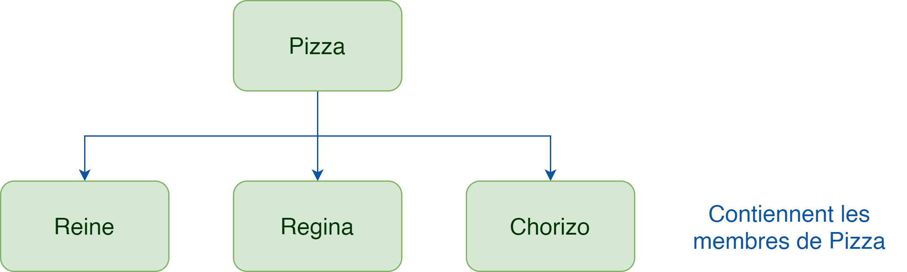

Source: [Composition vs Héritage](https://itexpert.fr/blog/concepts-fondamentaux-poo/#composition)  

----------
### Adapter

Le but du design pattern `Adapter` est de convertir l'interface d'une classe donnée en une interface attendue par des clients afin qu'ils puissent travailler ensemble.  

En résumé, `Adapter` permet de donner à une classe existante une nouvelle interface pour répondre aux besoins d'un client. 

#### Version générique

Source: https://refactoring.guru/design-patterns/adapter  

#### Version concrète
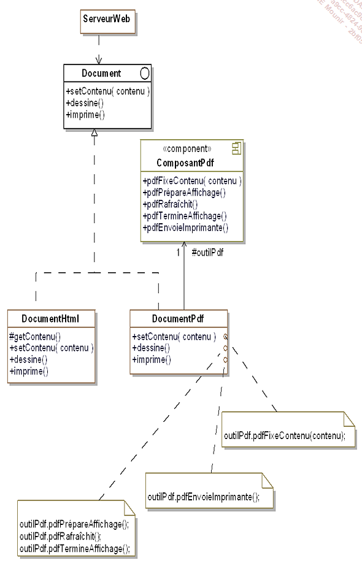

**Composition**: `protected ComposantPdf outilPdf = new ComposantPdf();`.

**Adapter**: Classe `ComposantPdf` car elle hérite de l'interface et permet d'appeler d'autres méthodes

### Bridge

Le design pattern `Bridge` est utilisé pour séparer le comportement de l'implémentation de l'interface et de l'implémentation de l'objet.  

#### Version générique
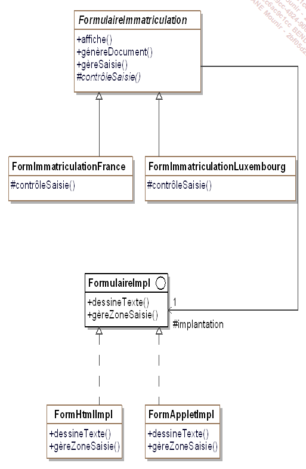
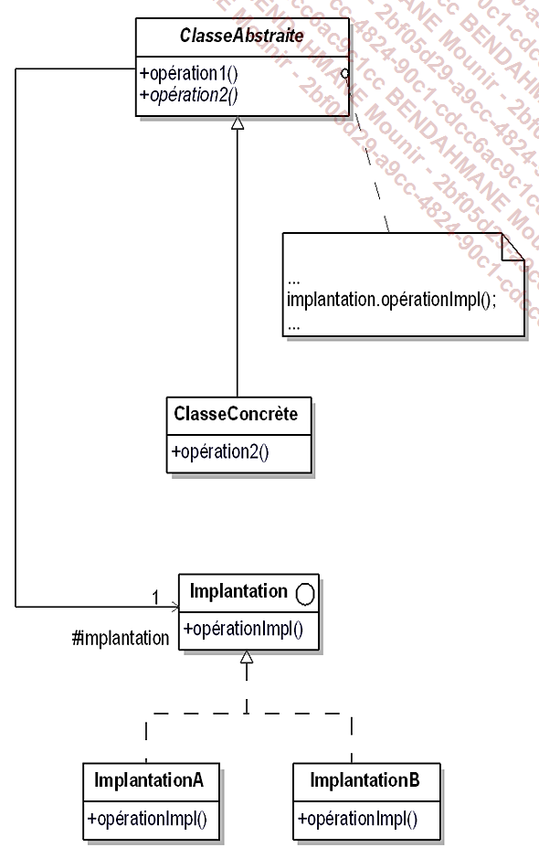

#### Version concrète
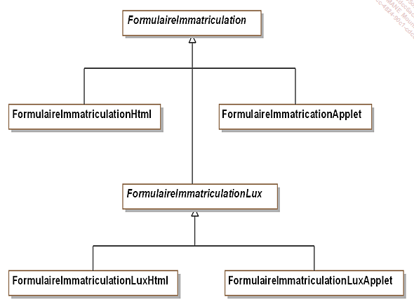

On s'intéresse au demande d'immatriculation des véhicules.  
Le formulaire de demande d'immatriculation possède deux implémentations différentes.  

Classe abstraite mère: FormulaireImmat  
Classes filles :
- FormulaireImmatHTML
- FormulaireImmatAPP

Au départ le système a été conçu pour la France uniquement.  
Ensuite on a du créé en sous-classe FormulaireImmatCH elle aussi abstraite pour avoir également deux sous-classes concrètes (qui sont FormulaireImmatHTML et FormulaireImmatAPP dédiées à la Suisse).  


**Partie Abstraction** : `abstract class`
**Partie Implémentation** : `interface`

L'`abstract class` appelle l'`interface`

### Composite

Le design pattern `Composite` est un patron de conception structurel qui permet d’agencer les objets dans des arborescences afin de pouvoir traiter celles-ci comme des objets individuels.  


Ce pattern offre un cadre de conception d'une composition d'objets dont on ne connaît pas la profondeur (On peut utiliser un arbre en tant qu'analogie).  

Les "clients" interagissent avec les objets sans connaitre la structure de l'arbre.  

#### Version générique
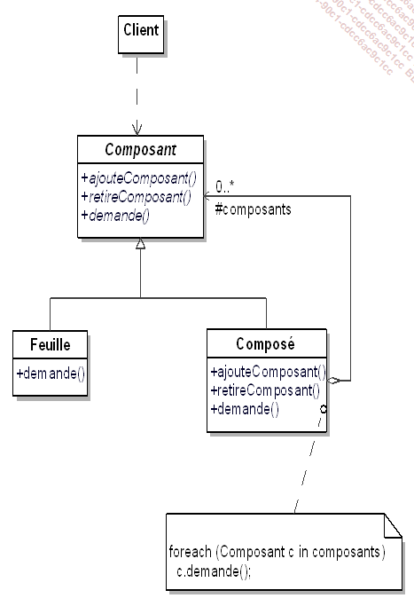

#### Version concrète
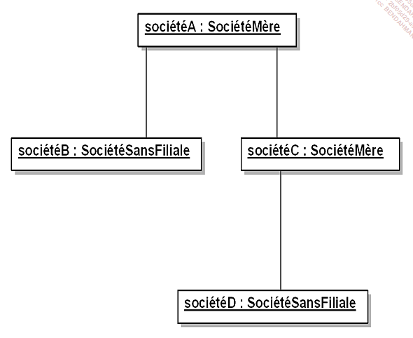

### Decorator

Ce pattern permet d'ajouter **DYNAMIQUEMENT** des fonctionnalités **SUPPLEMENTAIRES** à un objet sans modifier l'interface de l'objet ("les clients de l'objet ne sont pas au courant de la modification").  

Il s'agit d'une alternative à la création d'une sous-classe qui permettrait d'enrichir l'objet.  

#### Version générique
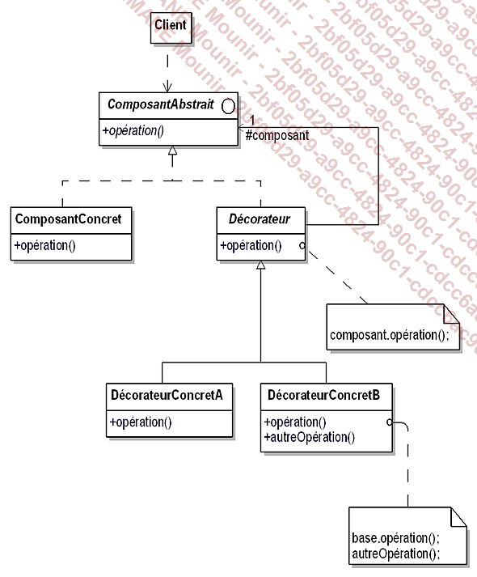

#### Version concrète
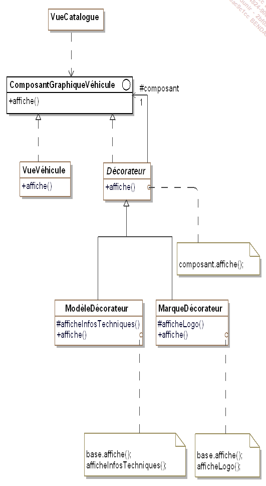

## Pattern de comportement

### Introduction

Les patrons de comportement permettent de distribuer des traitements/ des algorithmes entre les objets.  

Ils organisent les interactions en renseignant le "flux de controle" et de traitement au sein d'un système d'objets.  

La distribution se fait soit par héritage soit par "délégation".  

### Chain of Responsability

Le but est de construire une chaine d'objets de manière à ce que si un objet de la chaine ne peut répondre à une enquête, il puisse la passer à un "successeur" et ainsi de suite jusqu'à ce que l'un des objets puissent y répondre.

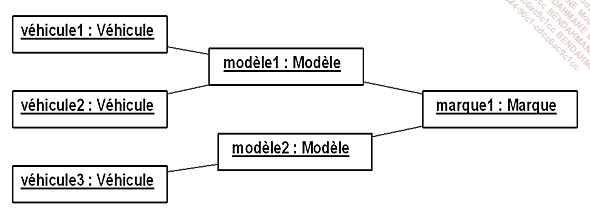

#### Version générique
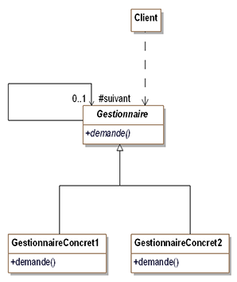

#### Version concrète
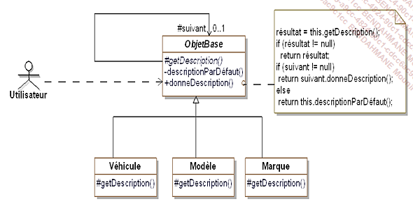

### Command

Ce pattern transforme une requête en objet  
Ceci facilite les opérations relatives à la requête ex: Annulation, queue, suivi, etc...  

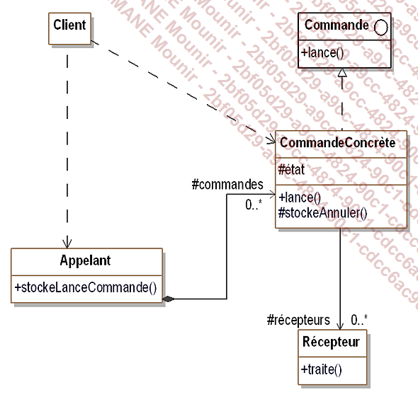
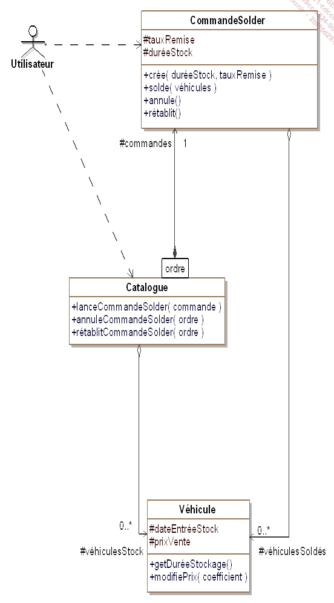

### Iterator

#### Version concrète
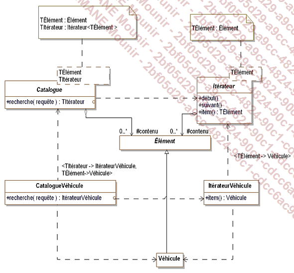

#### Version générique
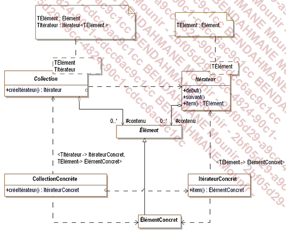

### Mediator

Le but de `Mediator` est de construire un objet.  
Le rôle de l'objet est de gérer/controler les interactions entre les autres objets.  
Les objets ne sont pas censés se connaître entre eux.  
Il s'occupe de la gestion.  

#### Version concrète
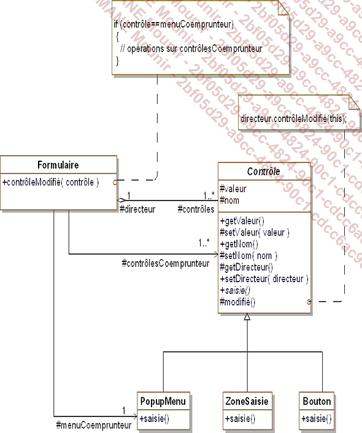

#### Version générique
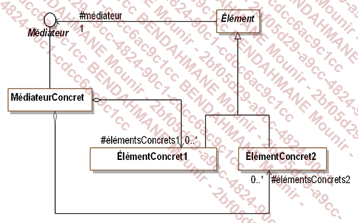