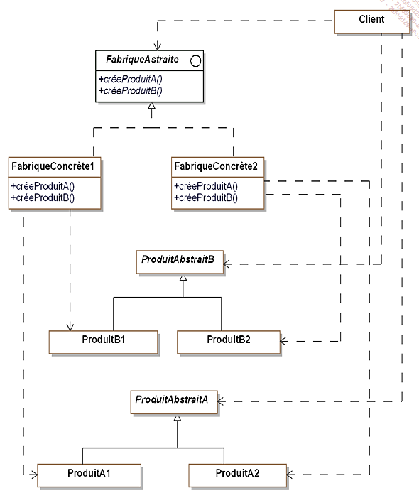
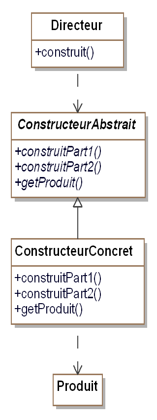
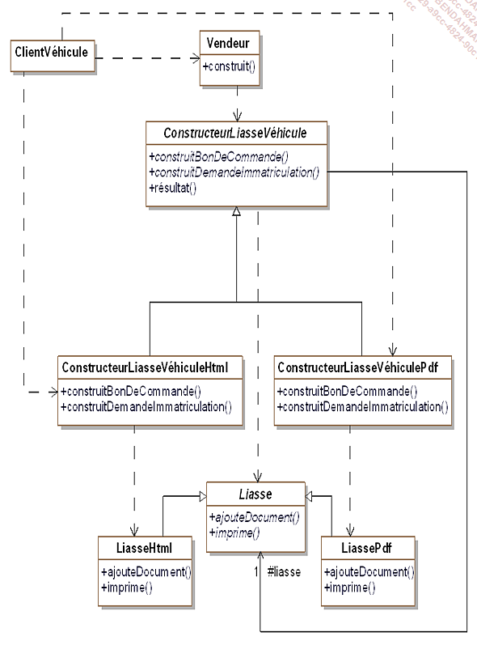
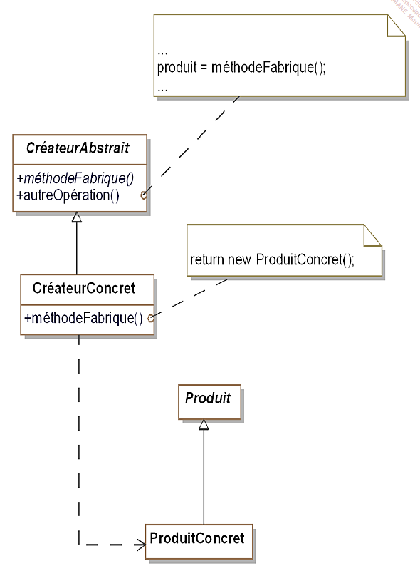
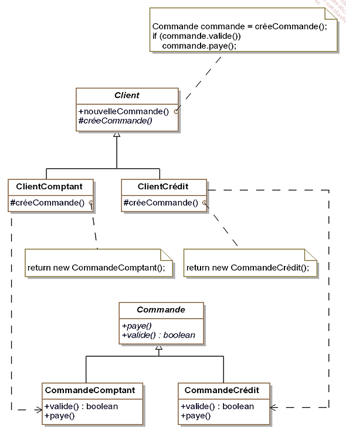
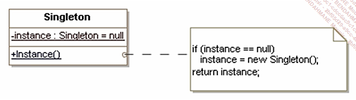
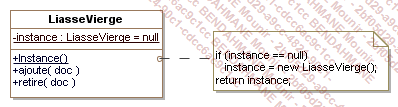
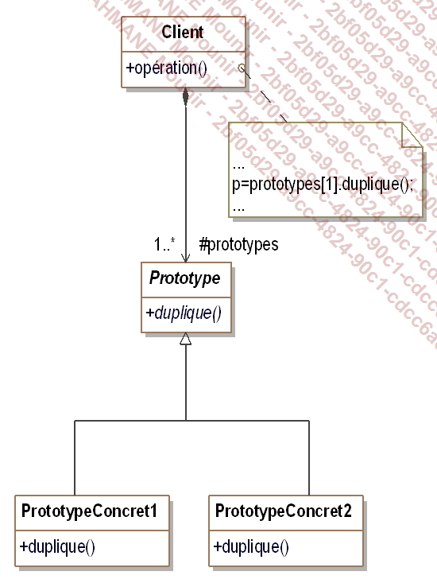
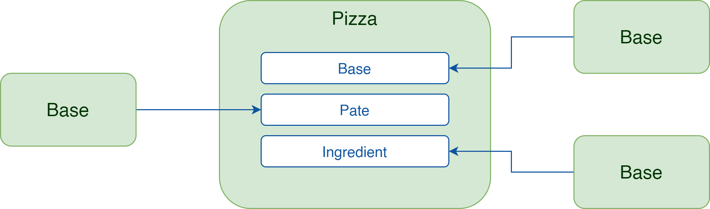
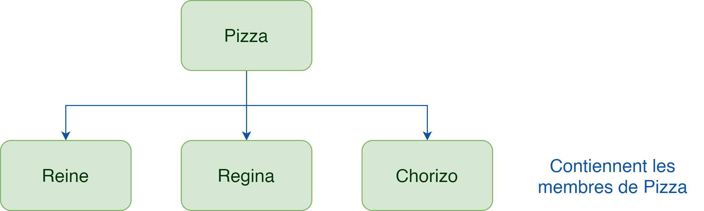

# ESGI - Design Pattern en C#
###### tags: `Sciences U`, `ESGI`, `Design Pattern`, `.NET`, `C#`
###### date de dernière modification: `04/07/2022`

### Table des matières
- [Pattern de conception](#pattern-de-conception)  
  - [Abstract factory](#abstract-factory)  
  - [Pattern Builder](#pattern-builder)  
  - [Factory Method](#factory-method)  
  - [Singleton](#singleton)  
  - [Prototype](#prototype)  
- [Pattern de structure ou de structuration](#pattern-de-structure-ou-de-structuration)
  - [Introduction](#intro)
  - [Adapter](#adapter)

## Pattern de conception
Permet de faciliter et optimiser la conception d'objet dans une application.

### Abstract Factory
`Abstract Factory` est un pattern qui aide à la création d'objet, le but est de regrouper les objets en famille sans avoir à connaitre les bases de ces objets.  

`Abstract Factory` va permettre de déresponsabiliser la classe mère. Pour cela, nous utilisons une interface qui va contenir des signatures de méthodes.  

Ici `FabriqueVehicule` est une interface qui contient deux signatures de méthodes `créeAutomobile()` et `créeScooter()`.  

La classe `Scooter` est une classe mère d'héritage, les classes filles `ScooterElectricité` et `ScooterEssence` utilisent `extends Scooter` pour étendre cette classe.  

#### Version générique vue en cours


#### Version concrète vue en cours


Dans le second schéma, version générique du pattern, les structures sont affichées de façon plus générique
`FabriqueConcrète1` et `FabriqueConcrète2` correspondraient à `FabriqueVéhiculeElectricité` et `FabriqueVehiculeEssence`.  

`ProduitAbstraitA` correspond à scooter et `ProduitAbstraitB` à `Automobile`.  

### Pattern Builder

Création d'objets complexes sans avoir à s'occuper des problèmes d'implémentations
#### Version générique vue en cours


#### Version concrète vue en cours


Ce pattern est utilisé pour séparer l'implémentation d'un cas spécifique de la logique/ du client.

Un client (utilisateur physique ou logiciel) a besoin de construire des objets complexes sans connaître son implémentation.  
Construire des objets complexes ayant plusieurs implémentations.  

### Factory method

Généraliser la construction
`Builder` pour préparer la création d'objet

#### Version générique vue en cours


#### Version concrète vue en cours


### Singleton

Pour les patternes de type factory, on essaie de s'arranger pour que ce soit un singleton.

Notre application va utiliser la classe liasse vierge (LiasseVierge) qui ne possédera qu'une seule instance.

Pattern abstract factory est susceptible d'utiliser ce type d'instance.

Le pattern singleton est utilisé pour créer une instance unique d'une classe.
Dans certains cas c'est utile d'avoir une classe qui ne peut être définie que d'une seule instance.  
Méthode de classe unique chargée de retourner cette instance.  
Pattern qui fournit une méthode de classe pour retourner cette instance (méthode statique).  

#### Version générique vue en cours


#### Version concrète vue en cours


Chaque classe qui utilise la liasse vierge doit avoir accès à la même instance.  

On doit surtout s'arranger pour qu'on ne puisse pas en créer de nouvelles (avec l'opérateur new)  

Singleton est une instance globale  

Exemple de singleton:
```csharp
    public class Vendeur
    {
        private static Vendeur _instance = null;

        private Vendeur() {
        }

        public static Vendeur Instance()
        {
            if (_instance == null)
                _instance = new Vendeur();
            return _instance;
        }
    }
```

```csharp
    static void Main(string[] args)
    {
        Vendeur vendeur1 = Vendeur.Instance();
        Vendeur vendeur2 = Vendeur.Instance();

        vendeur1.sales = 10;
        if(vendeur2.sales == vendeur1.sales)
            Console.WriteLine("Singleton fonctionnel");
        else
            Console.WriteLine("Singleton non fonctionnel");
    }
```

### Prototype

Permet de cloner des objets  

Le pattern prototype permet la création d'objets à partir d'autres objets appelés "prototypes" disposant d'une méthode `Clone()` qui retourne un objet identique.  



Exemple du design pattern Prototype:
```csharp
public abstract class Document
{
  protected string contenu = "";

  public Document duplique()
  {
    Document resultat;
    resultat = (Document)this.MemberwiseClone();
    return resultat;
  }

  public void remplit(string informations)
  {
    contenu = informations;
  }

  public abstract void imprime();
  public abstract void affiche();
}
```
Lien vers [Object.MemberWiseClone](https://docs.microsoft.com/fr-fr/dotnet/api/system.object.memberwiseclone?view=net-6.0)

## Pattern de structure ou de structuration

### Intro

Les patterns de structuration permettant de faciliter l'indépendance de l'interface d'un objet et de son implémentation.  

En fournissant les interfaces ce pattern permet d'encapsuler la composition des objets.  

Cela augmente le niveau d'abstraction d'un système donné un peu à la manière des patterns de création qui encapsulent la création d'objets.  

Ces patterns mettent en avant les interfaces.  

----------
Exercice: Différence entre Composition et Héritage 
**Composition**: C'est le fait d'avoir une instance d'une classe dans une autre classe  


**Héritage**: Une classe fille hérite des propriétés et des méthodes de la classe parente  


Source: [Composition vs Héritage](https://itexpert.fr/blog/concepts-fondamentaux-poo/#composition)  

----------
### Adapter

