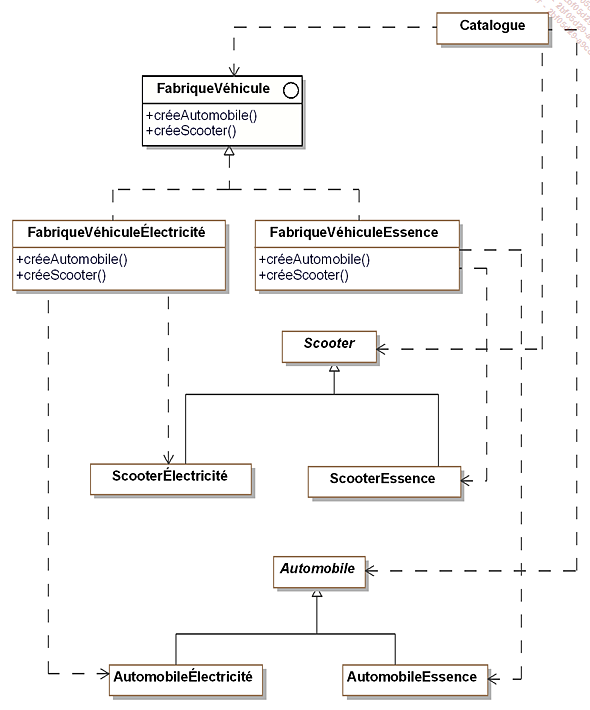

# ESGI - Design Pattern en C#
###### tags: `Sciences U`, `ESGI`, `Design Pattern`, `.NET`, `C#`
###### date de dernière modification: `04/07/2022`

## Abstract Factory
`Abstract Factory` est un pattern qui aide à la création d'objet, le but est de regrouper les objets en famille sans avoir à connaitre les bases de ces objets.  

`Abstract Factory` va permettre de déresponsabiliser la classe mère. Pour cela, nous utilisons une interface qui va contenir des signatures de méthodes.  

Ici `FabriqueVehicule` est une interface qui contient deux signatures de méthodes `créeAutomobile()` et `créeScooter()`.  

La classe `Scooter` est une classe mère d'héritage, les classes filles `ScooterElectricité` et `ScooterEssence` utilisent `extends Scooter` pour étendre cette classe.